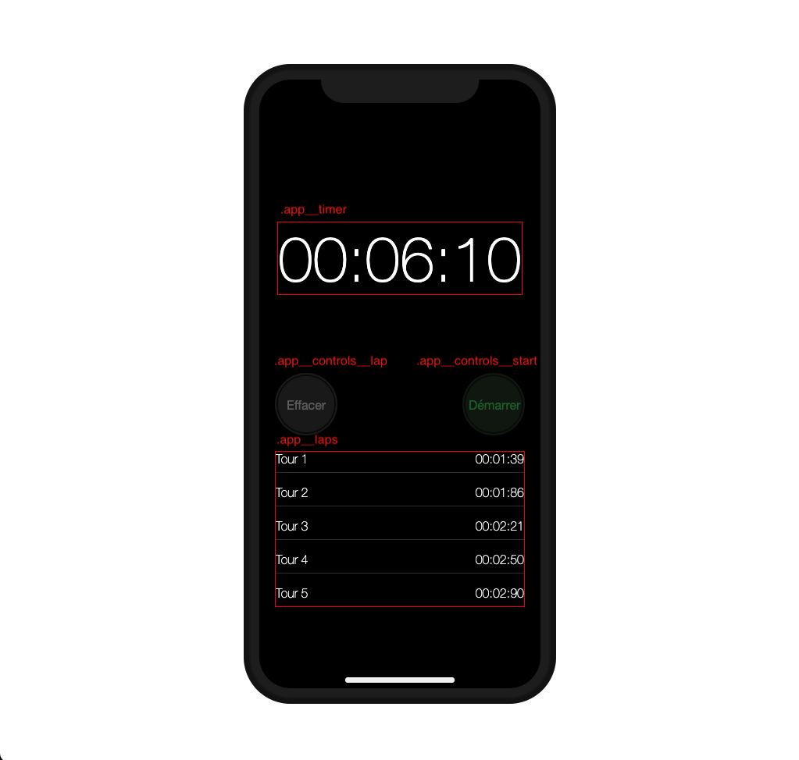
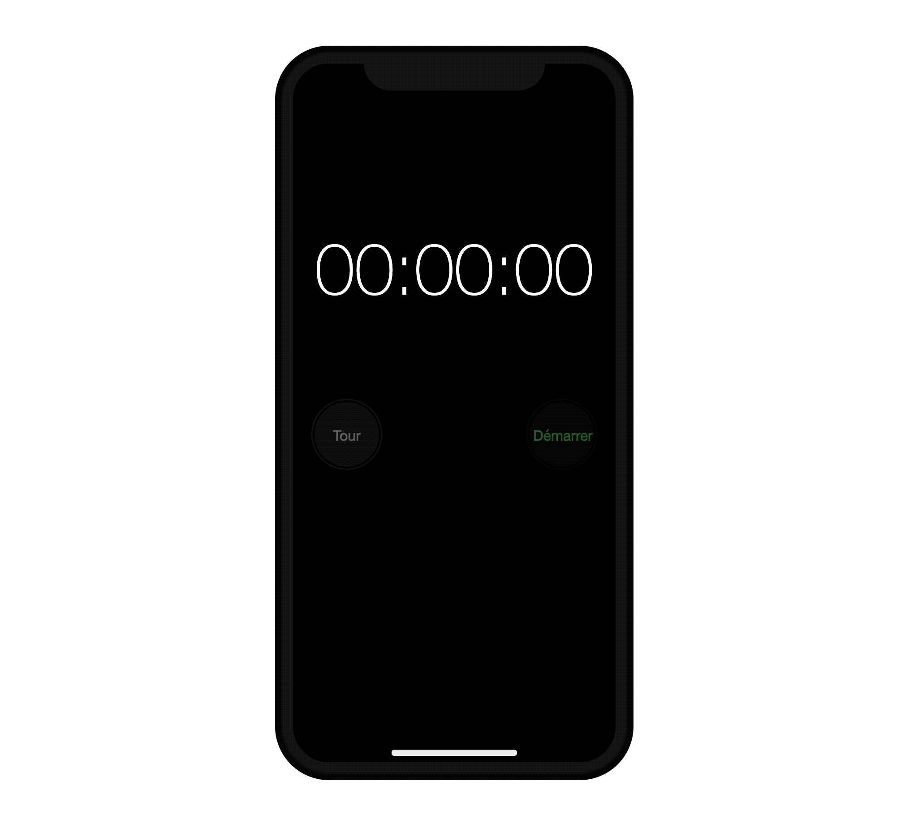
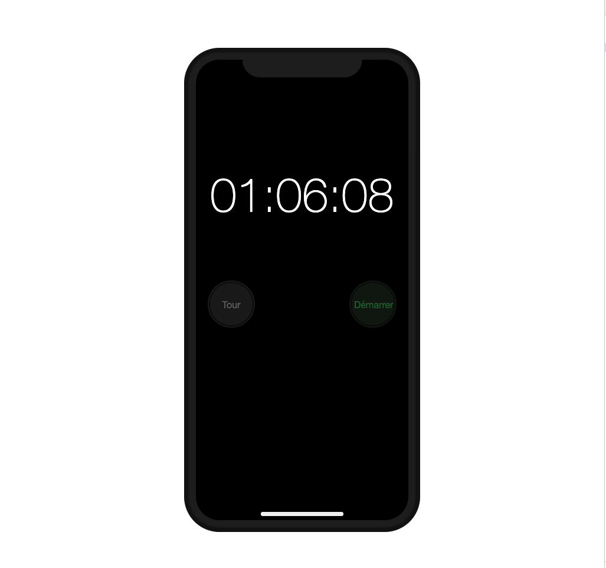
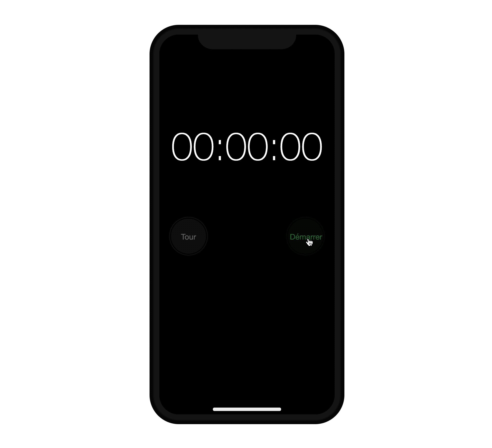
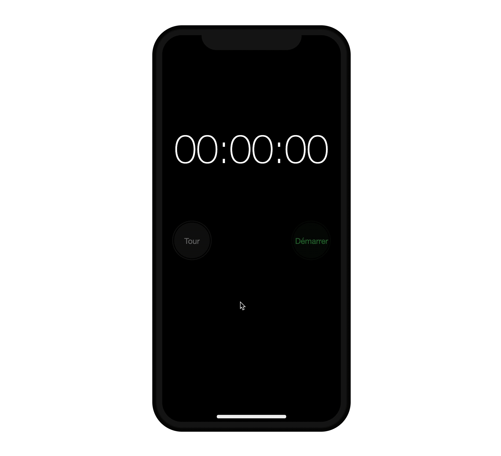
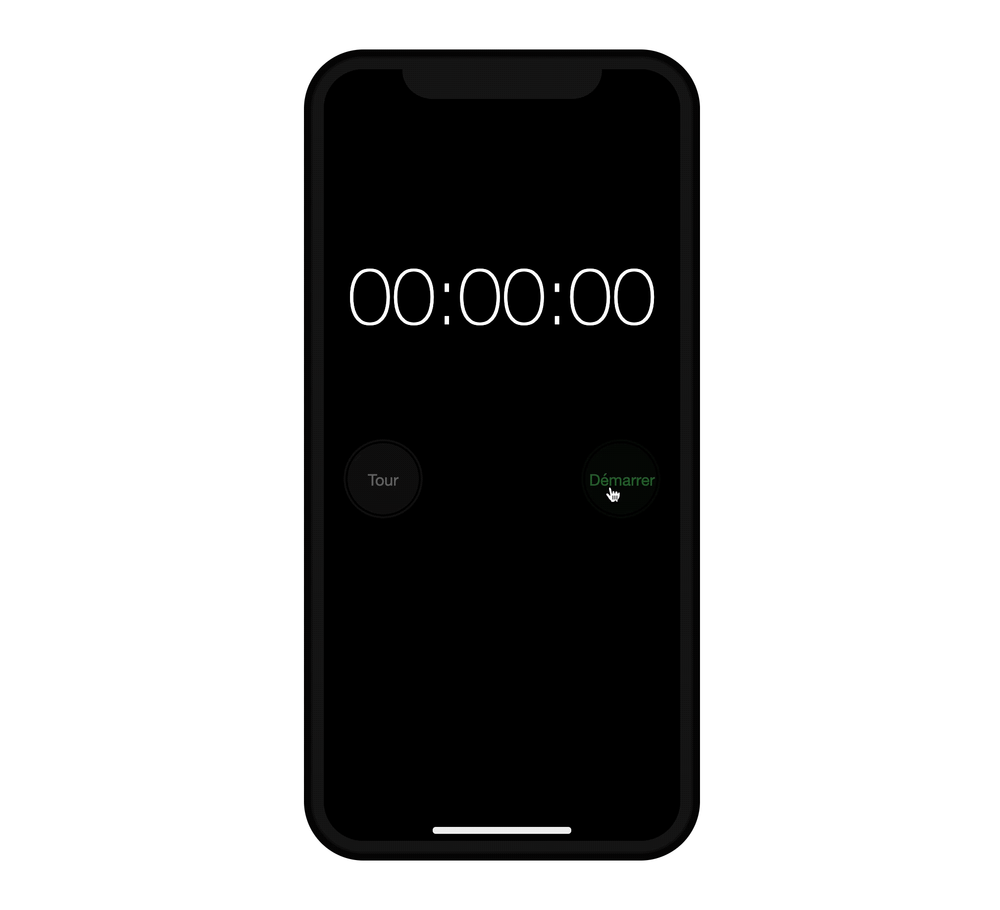
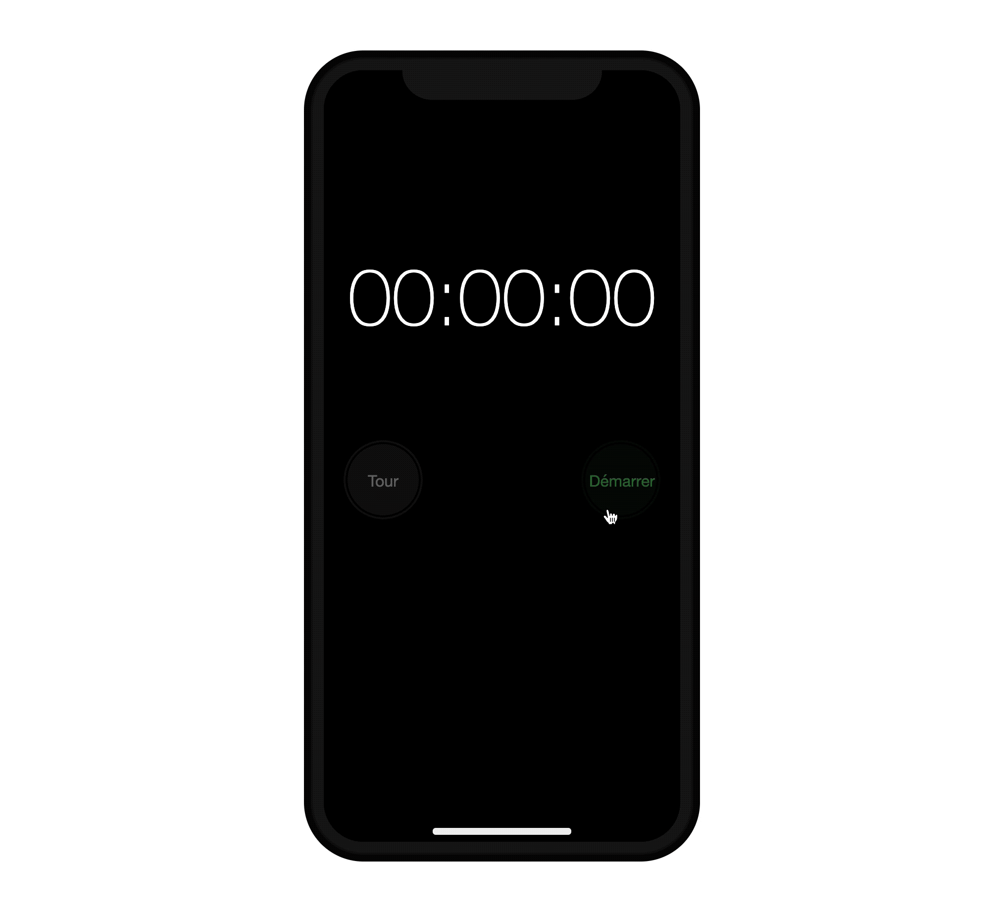

# Chronomètre IOS

> Examen DCC août 2020-2021

Dans le cadre de cet examen, nous vous demandons de reproduire  une version JavaScript du chronomètre disponible sous IOS.

## Consignes pour l'examen

1. Renommez le dossier qui porte le nom `examen-dcc-aout-2020-2021` en `examen-dcc-aout-2020-2021-nom-prenom-group`.
1. Dans le cadre de cet examen de *Développement Côté Client* vous devez uniquement vous focaliser sur le fichier `index.js`, qui se trouve à la racine. Mis à part ajouter la balise `script`, on ne vous demande pas de modifier le code HTML ni le code CSS qui s'y rapporte.
1. Cet examen dure maximum 4 heures.

## Identification des éléments d’interface

Dans la capture d’écrans ci-dessous, vous pouvez voir l’application avec ses noms de classes, correspondant aux différents éléments que vous devez manipuler.



## Les fonctionnalités

### Démarrer le chronomètre



Pour démarrer le chronomètre, il faut lancer une fonction qui s'exécutera toutes les 10 millisecondes au clic sur le bouton `.app__controls__start`. Cette fonction met à jour le temps écoulé, composé de *millisecondes*, *secondes* et *minutes*. Vous incrémentez, toutes les 10 millisecondes, l'unité des millisecondes. Quand on atteint 100 (soit 1000 millisecondes) il faut incrémenter les secondes d'une unité. Quand on atteint les 60 secondes, il faut incrémenter les minutes de 1. Nous ne considérons pas le cas où les minutes dépassent 99.

Remarquez, tout de même, que vous devez préfixer les chiffres inférieurs à 10 d'un `0`. Ainsi 6 secondes s’écrivent `06`.



### Enregistrer les tours



Il s'agit simplement de recopier dans la liste `.app__laps` un nouvel item respectant le format suivant :

```html
<li class="app__lap">
 <span class="app__lap-count">Tour n</span>
 <time class="app__lap-value" datatype="XX:YY:ZZ">XX:YY:ZZ</time>
</li>
```
Le `n` représente le nombre de tours enregistré. `XX` représente les minutes, `YY` les secondes et `ZZ` les millisecondes.

### Arrêter le chronomètre


Dès que le chronomètre est lancé, le bouton `.app__controls__start` affiche `Stop`. Quand on clique sur ce bouton, le chronomètre s'arrête, sans rien effacer. Une fois le chronomètre arrêté, le bouton `.app__controls__start` affiche `Démarrer` et le bouton `.app__controls__lap` affiche `Effacer`.

### Relancer le chronomètre


Quand le chronomètre est arrêté, le bouton `.app__controls__start` affiche `Démarrer` qui permet de relancer le chronomètre. Le bouton des tours qui affiche `Effacer` affiche de nouveau `Tour` dès que le chronomètre est relancé. Le bouton `.app__controls__start` affiche  `Stop`.

### Remettre à zéro le chronomètre


Quand le chronomètre est arrêté, le bouton des tours affiche `Effacer` au clic cela supprime tous les *items* dans la liste `.app__laps` et remet le chronomètre à zéros. Le bouton `.app__controls__start` affiche `Démarrer` et le bouton `.app__controls__lap` affiche `Tour`.

## Contraintes techniques

1. Pour mettre à jour le temps écoulé, vous devez utiliser la fonction `setInterval()`. Voici le [lien](https://developer.mozilla.org/en-US/docs/Web/API/WindowOrWorkerGlobalScope/setInterval) vers la documentation officielle. Vous devez donc conserver une référence vers l’`intervalID` pour pouvoir arrêter l’appel de la fonction. 
1. Pour changer le texte des boutons, `.app__controls__start` et `.app__controls__lap` vous devez utiliser le contenu de l’attribut `data-alternate`.
1. Vous devez suivre les bonnes pratiques utilisées dans le cadre du cours avec au moins un objet qui encapsulent les méthodes et propriétés dont vous avez besoin.

## Données

1. Vous devez créer une classe `Timer` qui contient quatre propriétés `_milliSeconds`, `_seconds`, `_minutes` et `_lapCount` et encapsuler uniquement la gestion du temps ainsi que des tours dans cette la classe. 
1. Vous devez créer un objet `StopWatch` qui contient la logique de votre chronomètre ainsi que les considérations liées à l'affichage.

## Bonus 🥳

Pour ce bonus on vous demande de maintenir le scroll de liste `.app__laps` scrollé de sorte que les derniers éléments ajoutés à la fin de la liste restent visibles.


